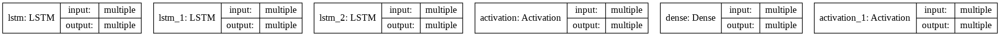
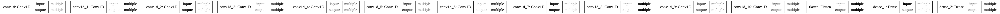

# Music Generation

Music is generated by training 2 different models with "mendelssohn" Piano MIDI files.

1) A Simple WaveNet Model

2) LSTM Model

Website for Description of WaveNet : https://deepmind.com/blog/article/wavenet-generative-model-raw-audio

Source of Dataset : https://www.kaggle.com/soumikrakshit/classical-music-midi

## Description:

MIDI Files contains Notes and Chords of Music. We extract MIDI files, encode them and train by creating a Deep Learning Model. Run the code for sufficiently large number of epochs for the dataset selected to achieve good results. The code runs for a fairly good amount of time. It is recommended to run it on a GPU. Finally we make the model to generate new Music and save it as a MIDI file.

Convert MIDI files to mp3 from the following website: https://audio.online-convert.com/convert/midi-to-mp3

## Models:

1) LSTM Model

2) WaveNet

## Results:

WaveNet Model achieved a smaller loss than LSTM Model for same no.of Epochs and Batch Size. Music generated by WaveNet Model is more better than LSTM Model.
